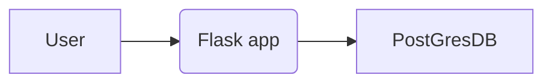
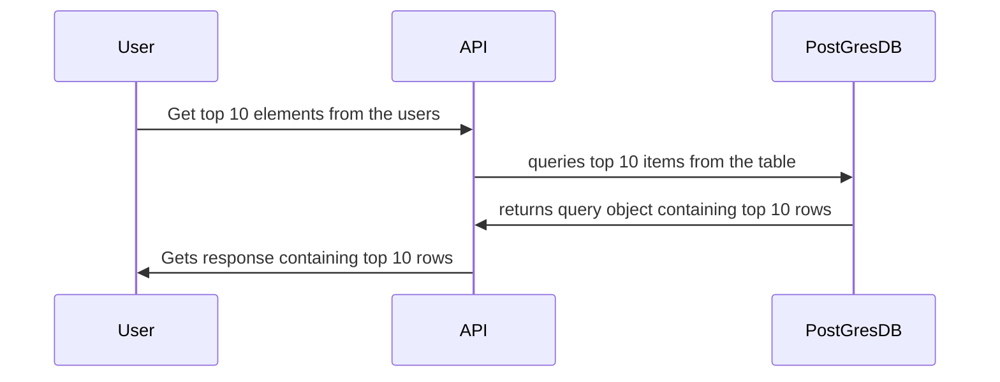

### flask app example to show case CI CD pipeline

## RUN THE APP USING BELOW Command
```
docker-compose up
```

Here is the flowchart of API 


```mermaid
flowchart LR
  User --> API(Flask app) --> PostGresDB
```


```mermaid
sequenceDiagram
  participant User
  participant API
  participant PostGresDB
  
  User->>API: Get top 10 elements from the users
  API->>PostGresDB: queries top 10 items from the table
  PostGresDB->>API: returns query object containing top 10 rows
  API->>User: Gets response containing top 10 rows
  
```
